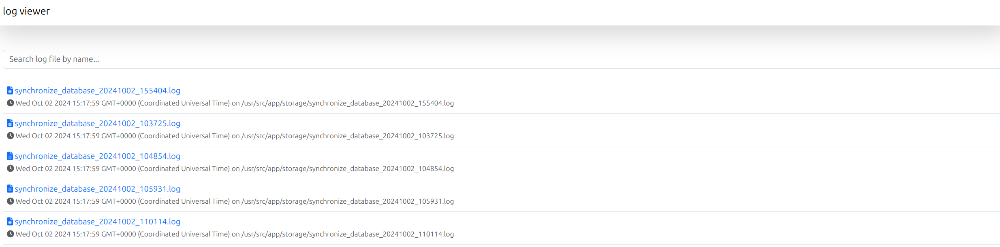

# Reader: simple file reader

Simple file reader made with node.js and express to read your text files on the browser.
Security specifications are responsibility of developers that implements this library on his projects.

### List your log files

Files are listed on the directory as you mark as origin ordered by creation date.



### Filter you files

You can search a specific files. Only write on the search input to filter files on the list.
The filter is made on realtime.


### View the file content

If you need to review the file content, only click on the file.


### Filter the file content

If you need to find a specific content on file, use the search input.


## Install with Docker

If you need to add on your project, you can download the image from Docker Hub.

```bash
docker pull agileworksnet/reader:latest
```

```bash
docker run --volume=./storage:/usr/src/app/storage:rw --workdir=/usr/src/app -p 3000:3000 --restart=always agileworksnet/reader:latest
```

### Docker compose

If you need to add as a service on your deployment stack, add this service to this `docker-compose.yml` file:

```
services:

  reader:
    image: agileworksnet/reader
    restart: always
    volumes:
      - ./storage:/usr/src/app/storage
    ports:
      - "3000:3000"
```

Important: bind the volume to your application or software storage path on your files are located:

```text
    volumes:
      - ./storage:/usr/src/app/storage
```

### Change the application base url

Use the `.env` file to config the application base url if you need to deploy 
with an application context.

```
# Replace by you env url
BASE_URL_PATH=http://localhost:3000/app/reader
```

#### Change another values

If you want to update the title and the description:

```text
APPLICATION_TITLE=MYAPPLICATION
APPLICATION_NAME="MY APPLICATION"
```

## Contributions

The contributions are welcome. Please, open an issue to discuss the changes before send a pull request.

## License

This project is licensed over MIT.